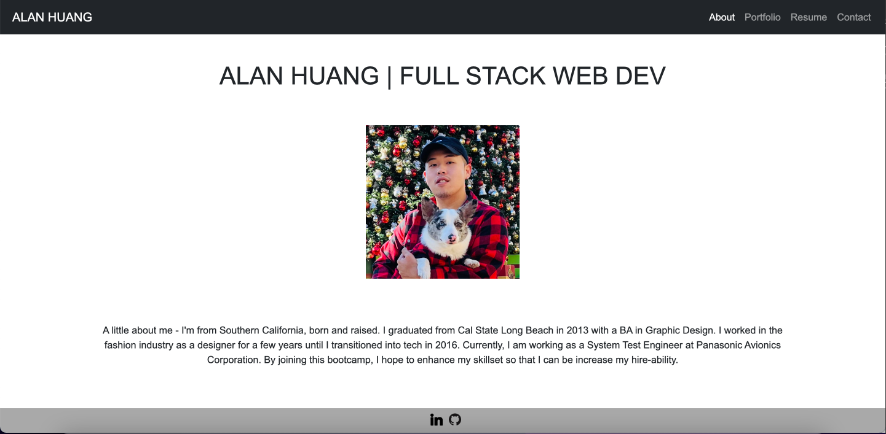
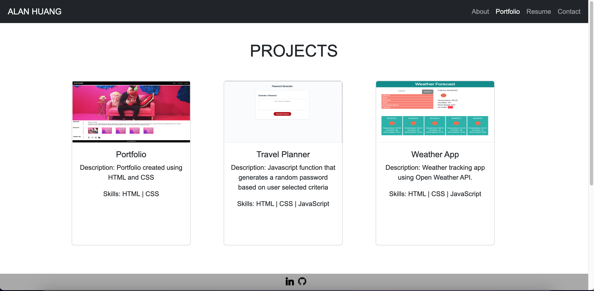
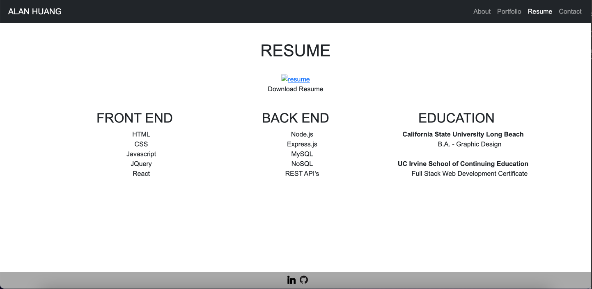
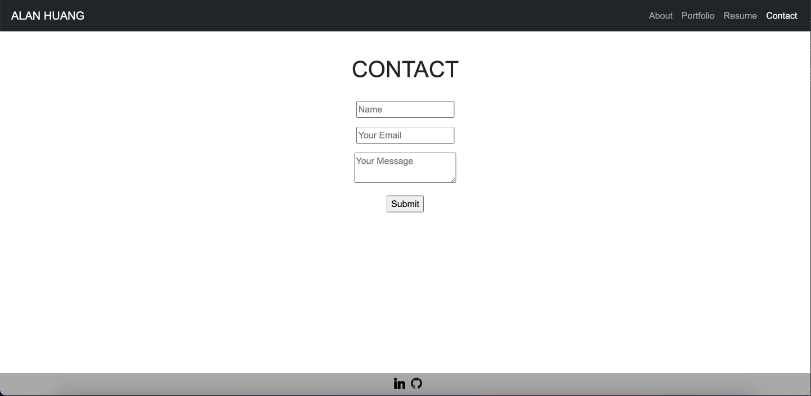

# C20_React_Portfolio

## Table-of-Contents
- [C20\_React\_Portfolio](#c20_react_portfolio)
  - [Table-of-Contents](#table-of-contents)
  - [Description](#description)
  - [Installation](#installation)
  - [Usage](#usage)
  - [Contributing](#contributing)
  - [Tests](#tests)
  - [Questions](#questions)
  - [Example](#example)
  - [Links](#links)
 
  ## Description
  This challenge was to create an portfolio using React. The user is able to navigate between pages without refreshing the window.
  There are 4 pages in the portfolio - About, Portfolio, Resume, & Contact.
  About - Short description about me
  Portfolio - Cards with 6 projects
  Resume - Downloadable Resume & short description of skills and education
  Contact - Form to keep in touch

  ## Installation
  N/A

  ## Usage
  N/A

  ## Contributing
  Currently, I am not accepting contributors for this project

  ## Tests
  N/A

  ## Questions
  For any questions, please reach out to me at the following:
  - GitHub: https://github.com/ahuang23
  - Email: a.huang232@gmail.com

  ## Example
  
  
  
  

  ## Links
  [GitHub](https://github.com/ahuang23/C19_TextEditor)
  [GitHub Pages](https://ahuang23.github.io/C20_React_Portfolio/)
